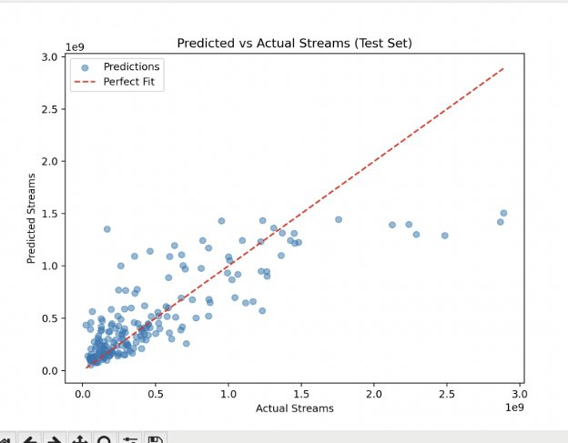

![ref1]

**Report - Machine Learning from Scratch: Kaggle Most Streamed Spotify Songs 2023** 

**Aastha Rajput, G23508408** 

**Computer Science, George Washington University** 

**Machine Learning: CSCI\_6364\_10** 

**Professor Armin Mehrabian** 

![ref1]

` `**Introduction** 

The Spotify 2023 dataset contains 953 songs with 24 features, including `artist\_count`, `released\_year`, `danceability\_%`, `key`, and `mode`. The goal of this project was to preprocess the dataset, implement Linear Regression from scratch, evaluate the model, and analyze the results, focusing on predicting the number of `streams` for each song. This task is part of Question 1 of the assignment, which aims to build a machine learning pipeline from scratch. 

**Approach Preprocessing** 

- Loaded the dataset with `latin1` encoding to handle `UnicodeDecodeError`. 
- Imputed missing values: numerical columns (e.g., `in\_shazam\_charts` with 50 missing values) with the mean, categorical columns (e.g., `key` with 95 missing values) with the mode. 
- Capped outliers using the IQR method for numerical columns (e.g., `artist\_count` capped at 3.5). 
- Scaled numerical features to [0, 1] using minmax scaling. 
- Converted `in\_deezer\_playlists` and `in\_shazam\_charts` to numerical by removing commas (e.g., `"1,021"` to `1021`). 
- Dropped irrelevant columns (`track\_name`, `artist(s)\_name`) to reduce dimensionality. 
- One-hot encoded categorical variables (`key`, `mode`), excluding `artist(s)\_name` to reduce features from 674 to 30. 
- Ensured all features were numerical using `.astype(float)` to avoid object array issues when saving/loading NumPy arrays. 

**Algorithm** 

- Implemented Linear Regression from scratch using gradient descent. 
- Used a learning rate of 0.001 and 5000 epochs to minimize the Mean Squared Error (MSE) cost function. 
- The MSE decreased steadily over epochs (e.g., from 1.96e+17 at epoch 1000 to 9.56e+16 at epoch 5000), indicating convergence. 

**Evaluation** 

- Split the data into 80% training (763 songs) and 20% testing (190 songs) sets using a custom `train\_test\_split` function with `random\_state=42` for reproducibility. 
- Computed MSE and R² metrics from scratch for both training and testing sets. 
- Visualized predicted vs. actual `streams` values with a scatter plot, saved as `docs/predicted\_vs\_actual.png`. 

**Challenges** 

- Encoding Issues: Had to use `latin1` encoding to load the dataset due to `UnicodeDecodeError`. 
- Object Arrays: Encountered `ValueError: Object arrays cannot be loaded when allow\_pickle=False` when loading `.npy` files, fixed by ensuring `X` and `y` were numerical arrays with `.astype(float)`. 
- Non-Numerical Columns: `in\_deezer\_playlists` and `in\_shazam\_charts` contained commas (e.g., `"1,021"`), causing conversion errors; fixed by removing commas and converting to floats. 
- High Dimensionality: One-hot encoding `artist(s)\_name` created 674 features, leading to potential overfitting; mitigated by excluding `artist(s)\_name`, reducing features to 30. 
- Gradient Descent Tuning: The large scale of `streams` (millions/billions) required a small learning rate (0.001) to ensure convergence without numerical instability. 

**Learnings** 

- Learned the importance of ensuring all features are numerical for machine learning algorithms, especially when working with NumPy arrays. 
- Gained a deeper understanding of Linear Regression and gradient descent, including the impact of learning rate and epochs on convergence. 
- Understood the need to balance feature dimensionality to avoid overfitting, particularly with categorical variables like `artist(s)\_name`. 
- Appreciated the importance of data preprocessing (e.g., handling missing values, outliers, and scaling) to improve model performance. 

**Results** 

- **Metrics:** 
- Training MSE: 9.56127449256094e+16 
- Testing MSE: 9.606791232741064e+16 
- Training R²: 0.7123 
- Testing R²: 0.6473 
- **Interpretation:** 
- The large MSE values are due to the scale of `streams` (millions to billions), as MSE 

squares the errors. 

- The R² scores indicate good performance for a simple Linear Regression model: the 

model explains 71.23% of the variance in the training data and 64.73% in the testing data. 

- The small gap between training and testing R² (0.7123 - 0.6473 = 0.065) suggests the 

model generalizes well and is not overfitting. 

- **Predictions:** 
- First 5 Test Predictions: [1.2248e+09, 2.7537e+08, 4.1230e+08, 8.6954e+08, 

1\.3618e+09] 

- First 5 Test Actual Values: [1.4791e+09, 7.8490e+07, 4.6144e+08, 1.0232e+09, 

1\.3099e+09] 

- The model performs reasonably well, with errors ranging from 52 million to 254 

million streams. It tends to underpredict for high stream counts (e.g., 1.2248e+09 vs. 1.4791e+09) and overpredict for lower stream counts (e.g., 2.7537e+08 vs. 7.8490e+07). 

- **Visualization:** 

`  `The scatter plot shows predicted vs. actual streams for the test set. Points are clustered around the red dashed line (perfect fit) for lower stream counts (0 to 1e9), indicating good predictions in this range. For higher stream counts (1e9 to 3e9), there’s more spread, with many points below the line, showing the model underpredicts for songs with very high streams. 

**Bias-Variance Analysis** 

- **Bias:** 
- The R² scores (0.7123 for training, 0.6473 for testing) are good but not excellent, 

suggesting moderate bias (underfitting). Linear Regression might be too simple to capture the complex, possibly non-linear relationships between features (e.g., `danceability\_%`, `energy\_%`) and `streams`. 

- The model struggles with extreme values (e.g., underpredicting high stream counts), as 

seen in the scatter plot and predictions. 

- **Variance:** 
- The small gap between training and testing R² (0.065) indicates low variance. The 

model generalizes well and is not overfitting. 

- Excluding `artist(s)\_name` helped reduce the risk of overfitting by lowering the 

number of features from 674 to 30. 

- **Tradeoff:** 
- The model has moderate bias but low variance. To improve performance, we could: 
  - Use a more complex model (e.g., polynomial regression or a decision tree, if 

allowed). 

- Engineer new features (e.g., interactions between `danceability\_%` and `energy\_%`). 
- Increase the learning rate or epochs to allow gradient descent to converge better, 

though this risks overfitting. 

- These improvements will be explored in Question 2, which focuses on the 

bias-variance tradeoff. 

[ref1]: Aspose.Words.0b6edcda-0488-48a5-b712-4219eac9c464.001.png
