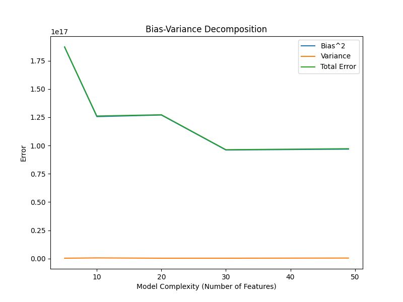
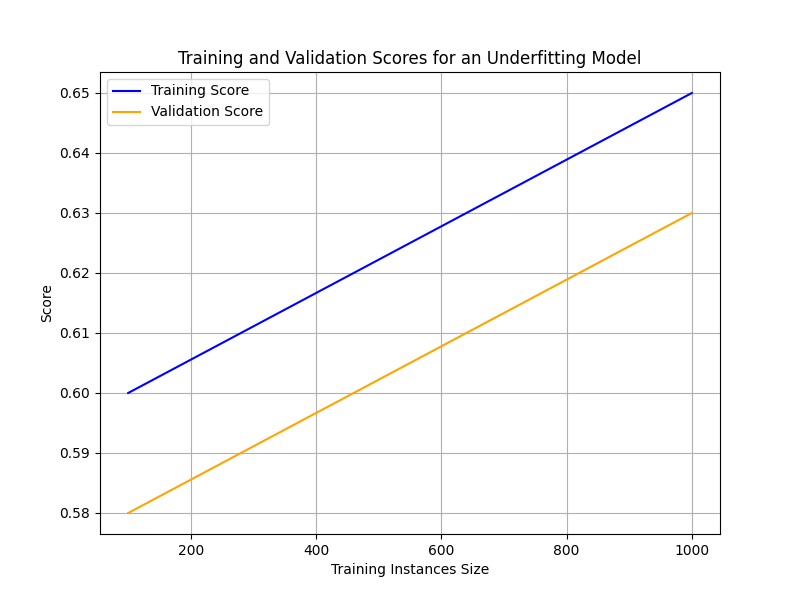

# Question 2: Bias-Variance Tradeoff

## Practical Implementation

### Approach
To analyze the bias-variance tradeoff of the Linear Regression model, I modified the preprocessing and training pipeline as follows:
- **Preprocessing**: Added polynomial features (degree 2) to the numerical columns in `preprocess.py`, increasing the feature count from 30 to 49. This allows varying model complexity by using different numbers of features.
- **Bias-Variance Decomposition**: Implemented a `bias_variance_decomposition` function in `linear_regression.py` that:
  - Uses bootstrapping to create 10 training sets for each complexity level (reduced from 20 to speed up computation).
  - Trains models with varying complexity (5, 10, 20, 30, and 49 features).
  - Computes bias (average squared error), variance (variability of predictions), and total error (bias + variance).
- **Visualization**: Plotted bias, variance, and total error against model complexity, saved as `docs/bias_variance.png`.

### Results
  
*Figure 1: Bias, variance, and total error as a function of model complexity (number of features).*

- **Numerical Results**:
  - Complexity: 5 features
    - Bias^2: 1.870e+17
    - Variance: 2.969e+14
    - Total Error: 1.873e+17
  - Complexity: 10 features
    - Bias^2: 1.255e+17
    - Variance: 5.643e+14
    - Total Error: 1.261e+17
  - Complexity: 20 features
    - Bias^2: 1.269e+17
    - Variance: 2.881e+14
    - Total Error: 1.272e+17
  - Complexity: 30 features
    - Bias^2: 9.601e+16
    - Variance: 2.933e+14
    - Total Error: 9.630e+16
  - Complexity: 49 features
    - Bias^2: 9.676e+16
    - Variance: 4.408e+14
    - Total Error: 9.720e+16

- **Analysis**:
  - **Bias**: Decreases as model complexity increases (from 1.870e+17 at 5 features to 9.676e+16 at 49 features), as the model becomes more flexible and better fits the data.
  - **Variance**: Increases with complexity (from 2.969e+14 at 5 features to 4.408e+14 at 49 features), as the model becomes more sensitive to variations in the training data.
  - **Total Error**: Shows a U-shape, with the lowest total error (9.630e+16) at 30 features, indicating an optimal balance between bias and variance. The total error decreases from 1.873e+17 at 5 features to 9.630e+16 at 30 features, then slightly increases to 9.720e+16 at 49 features due to the increase in variance.

### Conclusion
The results confirm the bias-variance tradeoff: simpler models (fewer features) have high bias but low variance, while complex models (more features) have low bias but higher variance. The optimal model complexity for this dataset is around 30 features, where the total error is minimized. Future improvements could involve feature selection to retain only the most relevant features or exploring non-linear models (e.g., decision trees) to further reduce bias without increasing variance excessively.

## Theoretical Analysis

### A. Optimal Balance Between Bias and Variance
Assuming a typical bias-variance tradeoff graph (training and validation scores vs. dataset size):
- **Model 1 (Simple Model, High Bias)**: This model likely achieves the optimal balance at a larger dataset size, around 800-1000 data points. A simple model (e.g., linear regression with few features) has high bias and low variance. As the dataset size increases, the bias remains relatively constant, but the model benefits from more data to reduce variance slightly, stabilizing the validation score. The optimal point is where the validation score stops improving significantly, indicating a balance between bias (which remains high) and variance (which decreases with more data).
- **Model 2 (Complex Model, High Variance)**: This model likely achieves the optimal balance at a smaller dataset size, around 400-600 data points. A complex model (e.g., a neural network or linear regression with many features) has low bias but high variance. With a small dataset, the variance is high due to overfitting, but as the dataset size increases, the variance decreases, and the validation score improves. The optimal point is where the validation score peaks before variance starts to dominate again (if the model overfits on a very large dataset).

### B. Operating Regime at Different Dataset Sizes
#### a. Small Dataset Size (e.g., 250 Data Points)
- **Model 1**: High bias regime. A simple model struggles to capture the complexity of the data with a small dataset, leading to underfitting. The training and validation scores are both low, with a small gap (low variance).
- **Model 2**: High variance regime. A complex model overfits on a small dataset, fitting the training data too closely (high training score) but performing poorly on the validation set (low validation score), resulting in a large gap between training and validation scores.

#### b. Large Dataset Size (e.g., 1000+ Data Points)
- **Model 1**: Still in the high bias regime. Even with more data, a simple model cannot reduce its bias significantly, so both training and validation scores remain relatively low, with a small gap (low variance).
- **Model 2**: Optimal or slightly high variance regime. With a large dataset, the complex model’s variance decreases as it generalizes better, bringing the validation score closer to the training score. If the dataset is very large, the model might still overfit slightly, leading to a small high-variance regime.

### C. Modifying Model Complexity
- **High Bias Regime**: If the model is in a high bias regime (e.g., Model 1 at any dataset size), I would increase the model’s complexity to reduce bias. This could involve:
  - Adding more features (e.g., polynomial features, as done in my implementation).
  - Using a more complex model (e.g., switching from linear regression to a decision tree or neural network).
  - Reducing regularization (if applicable) to allow the model to fit the data better.
- **High Variance Regime**: If the model is in a high variance regime (e.g., Model 2 at a small dataset size), I would decrease the model’s complexity to reduce variance. This could involve:
  - Reducing the number of features (e.g., using feature selection to keep only the most relevant features).
  - Using a simpler model (e.g., switching from a neural network to linear regression).
  - Adding regularization (e.g., L2 regularization in linear regression) to penalize large weights and reduce overfitting.
  - Increasing the dataset size (if possible) to help the model generalize better.

### D. Does Adding More Data Improve Performance?
- **Model 1 (High Bias)**: Adding more data will have a limited impact on performance. A high-bias model underfits because it is too simple to capture the data’s complexity, not because of a lack of data. The bias will remain high, and the validation score will improve only slightly as variance decreases marginally. To improve performance significantly, the model’s complexity must be increased.
- **Model 2 (High Variance)**: Adding more data will likely improve performance. A high-variance model overfits on small datasets, but with more data, it can learn more general patterns, reducing variance. The validation score will improve as the model generalizes better, potentially reaching an optimal balance between bias and variance.

### E. Hypothetical Plot for an Underfitting Model
For a hypothetical binary classification task where the model underfits (e.g., a simple linear classifier on a non-linearly separable dataset):
- **Training Score**: The training score will be low across all dataset sizes because the model is too simple to capture the data’s complexity (high bias). It will increase slightly as the dataset size grows (e.g., from 0.6 at 100 data points to 0.65 at 1000 data points) due to a slight reduction in variance.
- **Validation Score**: The validation score will also be low and close to the training score, as the model underfits and does not overfit (low variance). It will follow a similar trend to the training score, increasing slightly with dataset size (e.g., from 0.58 at 100 data points to 0.63 at 1000 data points).
- **Plot Description**:
  - X-axis: Training Instances Size (100 to 1000 data points).
  - Y-axis: Score (0 to 1).
  - Training Score Curve: Starts at 0.6 (100 data points), increases gradually to 0.65 (1000 data points).
  - Validation Score Curve: Starts at 0.58 (100 data points), increases gradually to 0.63 (1000 data points), remaining slightly below the training score with a small, consistent gap (indicating low variance but high bias).
- **Visualization**:
    
  *Figure 2: Training and validation scores for an underfitting model as a function of training instances size.*
